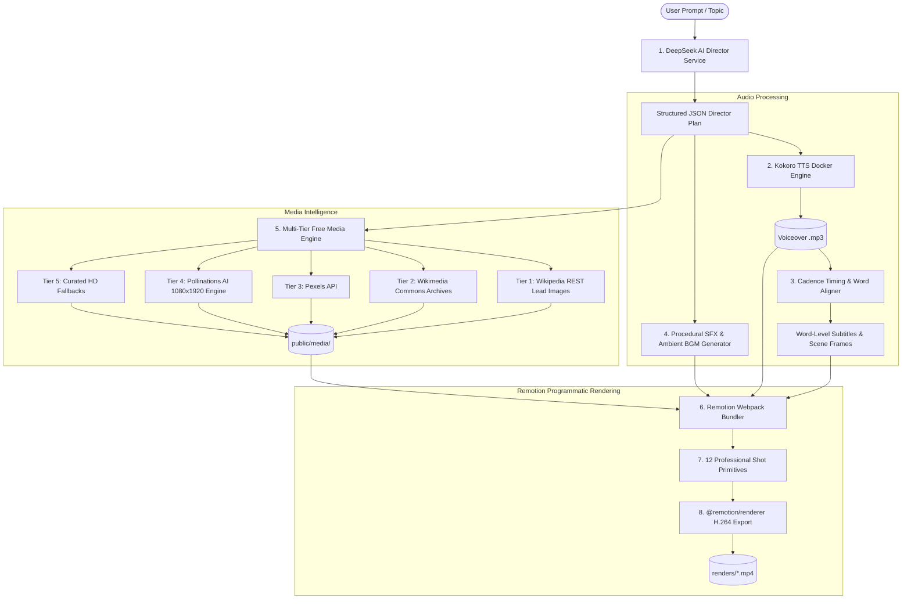

# 🎬 Universal Faceless Video Generator — Pipeline Architecture & Flow Documentation

This document provides a comprehensive technical breakdown of how the programmatic faceless video generation system works, including the multi-tier media engine, services, libraries, and the step-by-step execution flow.

---

## 1. High-Level Architecture Overview

The system operates as an autonomous **AI Director $\longrightarrow$ Voice Synthesizer $\longrightarrow$ Media Sourcing $\longrightarrow$ Sound Designer $\longrightarrow$ Programmatic Video Compositor**:



---

## 2. Core Technologies & Libraries Used

| Component / Layer | Technology / Library | Purpose |
|---|---|---|
| **AI Director & Storytelling** | `DeepSeek-V3 API` / `OpenAI API` | Generates 5-Beat narrative arcs, scene directions, camera plans, and entity search queries in structured JSON. |
| **Voiceover Synthesis (TTS)** | `Kokoro TTS` (Local Docker container) | High-speed, natural-sounding voice generation (24kHz/44.1kHz MP3) via local HTTP inference on port `8880`. |
| **Audio Analysis & Cadence Sync** | `music-metadata` + Custom JS Math | Parses exact audio duration down to the millisecond, calculates syllable weights and punctuation pauses for frame-accurate cuts. |
| **Media Sourcing & Archival** | `Wikipedia REST API`, `Wikimedia Commons API`, `Pollinations AI`, `Pexels API` | 5-tier zero-paywall media engine fetching real-world historical, corporate, and photorealistic visual assets. |
| **Sound Design Engine** | Custom Procedural PCM WAV Generator | Generates 44.1kHz 16-bit foley sound effects (`whoosh`, `impact_boom`, `sub_drop`, `paper_slam`) and ambient music beds offline. |
| **Video Compositor & Motion** | `@remotion/bundler`, `@remotion/renderer`, `remotion`, `react` | Programmatic frame-by-frame rendering with Spring physics, SVG animations, camera pans, and Hormozi active-word captions. |
| **Web Studio & API Server** | `express`, `dotenv` | Serves the web studio interface, live video player, and API endpoints (`http://localhost:3000`). |

---

## 3. How Visual Assets are Sourced & Generated

Media sourcing is handled by [`src/services/freeMediaService.js`](file:///d:/projects/videogenerator/src/services/freeMediaService.js). It uses an autonomous **5-Tier Cascading Engine**:

```
                         ┌────────────────────────────────────────┐
                         │      Scene Visual Query / Prompt       │
                         └───────────────────┬────────────────────┘
                                             │
                                             ▼
                         ┌────────────────────────────────────────┐
                         │ Tier 1: Wikipedia Page Summary API     │
                         │ (Official Lead Photo for Real Entity)  │
                         └───────────────────┬────────────────────┘
                                             │ (If not found / abstract)
                                             ▼
                         ┌────────────────────────────────────────┐
                         │ Tier 2: Wikimedia Commons MediaSearch  │
                         │ (Public Domain Archival Historical Doc)│
                         └───────────────────┬────────────────────┘
                                             │ (If no archival match)
                                             ▼
                         ┌────────────────────────────────────────┐
                         │ Tier 3: Pexels Portrait Photography    │
                         │ (High-Res Stock if API Key Present)    │
                         └───────────────────┬────────────────────┘
                                             │ (If not found / concept)
                                             ▼
                         ┌────────────────────────────────────────┐
                         │ Tier 4: Pollinations 1080x1920 AI Gen  │
                         │ (Photorealistic Narrative Sourcing)    │
                         └───────────────────┬────────────────────┘
                                             │ (If offline / timeout)
                                             ▼
                         ┌────────────────────────────────────────┐
                         │ Tier 5: Curated HD Fallback Library    │
                         │ (Instant Topic-Hashed Unsplash Asset)  │
                         └────────────────────────────────────────┘
```

### Detailed Tier Breakdown:

1. **Tier 1 — Wikipedia Summary REST API:**
   - **When used:** Whenever the AI Director outputs a `wikiQuery` (e.g. `"Airbnb"`, `"New York Stock Exchange"`, `"Julius Caesar"`, `"Caesars Palace"`).
   - **Endpoint:** `https://en.wikipedia.org/api/rest_v1/page/summary/${encodeURIComponent(title)}`
   - **Why it works:** Fetches the official high-resolution lead image curated by Wikipedia editors with zero authentication needed.

2. **Tier 2 — Wikimedia Commons MediaSearch API:**
   - **When used:** Historical maps, battle routes, patent diagrams, or public domain archives.
   - **Endpoint:** `https://commons.wikimedia.org/w/api.php?action=query&generator=search...`

3. **Tier 3 — Pexels API:**
   - **When used:** If `PEXELS_API_KEY` is provided in `.env` for portrait stock photography.

4. **Tier 4 — Pollinations AI 1080x1920 Engine:**
   - **When used:** Abstract or narrative storytelling scenes (e.g. *"startup founders working late in apartment"*, *"dramatic financial trading desk"*).
   - **Endpoint:** `https://image.pollinations.ai/prompt/${prompt}?width=1080&height=1920&nologo=true`
   - **Why it works:** Generates customized vertical photorealistic imagery on-demand without requiring API keys or subscriptions.

5. **Tier 5 — Curated HD Fallback Library:**
   - **When used:** If a network request times out or is offline.
   - **Why it works:** Has verified high-resolution photography mapped by topic hash so a render never crashes due to a missing asset.

---

## 4. Complete Step-by-Step Pipeline Flow

When you execute `node src/cli/generate.js` or click **"Generate Video Now"** in the Studio UI, [`src/pipeline/videoGeneratorPipeline.js`](file:///d:/projects/videogenerator/src/pipeline/videoGeneratorPipeline.js) executes the following 6 steps:

### Step 1: AI Visual Director Planning
- The AI Director sends the topic, category, and format to DeepSeek API with the strict system prompt from [`DIRECTOR.md`](file:///d:/projects/videogenerator/DIRECTOR.md).
- DeepSeek generates a continuous 30–38 second voiceover script (75–90 words) and divides it into a 5-beat narrative arc.
- Each scene is assigned:
  - `type`: One of the 12 shot primitives (e.g. `archival_documentary`, `animated_data_chart`, `evidence_paper`, `metric_hero`).
  - `voiceoverSentence`: Spoken words for this scene.
  - `camera`: Movement type (`push_in`, `pan_left`, `pull_out`, `shake`).
  - `sfx`: Foley sound effect (`whoosh`, `impact_boom`, `sub_drop`, `paper_slam`).
  - `params`: Search queries (`wikiQuery`, `imagePrompt`), date stamps, or metric numbers.

### Step 2: Kokoro TTS Voiceover Synthesis
- The voiceover script is sent to the local Kokoro TTS Docker container at `http://localhost:8880/v1/audio/speech`.
- Synthesizes a high-fidelity MP3 voiceover file with selected voice (`af_bella`, `am_adam`, `am_michael`, `af_sarah`) at 0.9x natural speed.
- Saved to `public/audio/video-[timestamp].mp3` and converted to base64 Data URL for zero-latency Remotion ingestion.

### Step 3: Cadence Audio Sync & Frame Calculation
- [`src/services/audioAnalysisService.js`](file:///d:/projects/videogenerator/src/services/audioAnalysisService.js) parses the generated MP3 duration using `music-metadata`.
- Calculates syllable weights and punctuation pauses (commas = +0.32s, sentence ends = +0.60s).
- **Scene Frame Alignment:** Calculates exact `startFrame` and `endFrame` for each scene based on the actual spoken duration of its `voiceoverSentence` (cuts happen at natural breath pauses).
- **Alex Hormozi Captions:** Groups words into 2–3 word chunks and assigns word-level timestamps so active words glow dynamically in real time.

### Step 4: Asset Sourcing & Base64 Ingestion
- For each scene, [`src/services/freeMediaService.js`](file:///d:/projects/videogenerator/src/services/freeMediaService.js) runs the 5-tier cascade.
- Downloaded images are stored in `public/media/` and converted to base64 Data URLs so Remotion can bundle them without network latency or CORS blocks.

### Step 4.5: Multi-Track Sound Design (SFX & Ambient BGM)
- [`src/services/sfxGeneratorService.js`](file:///d:/projects/videogenerator/src/services/sfxGeneratorService.js) ensures 44.1kHz WAV foley sound effects (`whoosh.wav`, `impact_boom.wav`, `sub_drop.wav`, `paper_slam.wav`, `click.wav`, `cash_register.wav`) and a 40-second ambient synth bed (`cinematic_ambient.wav`) exist.
- Sound effects are scheduled on exact frame numbers using Remotion `<Sequence>`.
- Ambient BGM is ducked to 12% volume under the narration voiceover.

### Step 5: Remotion Bundling & Compositing
- `@remotion/bundler` bundles `src/remotion/index.jsx` into a high-performance in-memory Webpack bundle.
- Remotion selects the composition (`DynamicShorts` for 1080x1920 vertical or `LandscapeExplainer` for 1920x1080).
- Sets `durationInFrames = timingData.totalFrames`.

### Step 6: Frame-by-Frame Rendering
- `@remotion/renderer` renders the composition using Chromium headless instances.
- Encodes video using H.264 / AAC at 30 FPS.
- Saves the final MP4 to `d:\projects\videogenerator\renders\[niche]-[format]-[timestamp].mp4`.
- Logs progress percentage in real time.

---

## 5. File Structure Reference

```
d:\projects\videogenerator\
├── package.json                           # Dependencies & run scripts
├── .env                                   # API Keys (DEEPSEEK_API_KEY, PEXELS_API_KEY)
├── DIRECTOR.md                            # Directorial rules & 5-Beat narrative arc contract
├── SHOT_LIBRARY.md                        # 12 Professional Remotion shot primitives
├── VIDEO_QUALITY_AUDIT.md                 # Forensic audit documentation
│
├── public/
│   ├── audio/                             # Generated Kokoro narration files
│   │   ├── sfx/                           # Generated 44.1kHz WAV sound effects
│   │   └── bgm/                           # Ambient background music beds
│   └── media/                             # Cached archival & photorealistic images
│
├── renders/                               # Final output .mp4 video files
│
├── src/
│   ├── cli/
│   │   ├── generate.js                    # CLI single video generation runner
│   │   └── batch.js                       # CLI batch multi-niche video runner
│   │
│   ├── config/
│   │   └── index.js                       # Environment config & path constants
│   │
│   ├── pipeline/
│   │   └── videoGeneratorPipeline.js      # Master end-to-end orchestration pipeline
│   │
│   ├── remotion/
│   │   ├── Root.jsx                       # Remotion composition registry
│   │   ├── compositions/
│   │   │   └── DynamicShorts.jsx          # Master composition & multi-track audio bus
│   │   ├── components/
│   │   │   ├── AnimatedCaptions.jsx       # Hormozi active-word glowing captions
│   │   │   ├── Camera.jsx                 # Camera motion & spring physics rig
│   │   │   └── CodeWindow.jsx             # VS Code editor typing component
│   │   └── scenes/
│   │       ├── ArchivalDocumentaryShot.jsx # Pan-and-scan historical/corporate photo
│   │       ├── AnimatedDataCrashShot.jsx   # Real-time SVG line chart animation
│   │       ├── EvidencePaperShot.jsx       # Leaked document with highlighter reveal
│   │       ├── KineticImpactWordShot.jsx   # 140px thumb-stop pattern interrupt
│   │       ├── MetricHeroScene.jsx         # 128px glowing statistic hero
│   │       ├── SplitComparisonScene.jsx    # Full-bleed Before/After split screen
│   │       └── ProcessFlowScene.jsx        # Architectural mechanism blueprint
│   │
│   ├── server/
│   │   └── studioServer.js                # Express Web Studio server (port 3000)
│   │
│   └── services/
│       ├── aiDirectorService.js           # DeepSeek prompt & narrative planner
│       ├── ttsService.js                  # Kokoro TTS Docker HTTP client
│       ├── audioAnalysisService.js        # Cadence timing & word timestamp sync
│       ├── freeMediaService.js            # 5-Tier cascading media engine
│       └── sfxGeneratorService.js         # Procedural WAV SFX & ambient music generator
```
