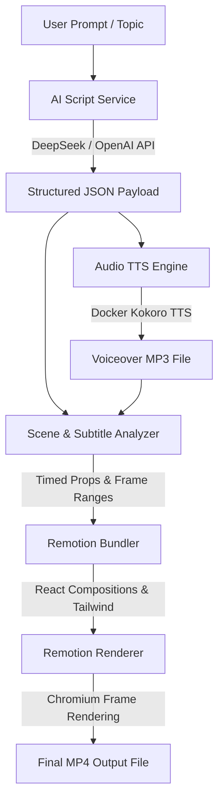

# 🎬 Faceless Video Generation Pipeline (Node.js + DeepSeek + Kokoro TTS + Remotion)

An enterprise-grade, high-performance programmatic video generation pipeline built for faceless YouTube channels, Instagram Reels, and TikTok.

---

## 🏛️ System Architecture Blueprint



### Key Components:
1. **The Brain (`src/services/aiScriptService.js`)**: Converts topics into structured JSON containing narration scripts, code snippets, key metrics, and visual layout instructions using **DeepSeek API** (with fallback template support).
2. **The Voice (`src/services/ttsService.js`)**: Connects to self-hosted **Kokoro TTS** running in Docker (`http://localhost:8880/v1/audio/speech`) to generate high-fidelity, natural human voiceovers at near $0 cost.
3. **The Timing Engine (`src/services/audioAnalysisService.js`)**: Measures audio duration, computes sentence & word timings for Hormozi-style animated pop-in captions, and maps visual scenes to frame ranges.
4. **The Visual Engine (`src/remotion/`)**: Programmatic React video templates supporting VS Code dark theme syntax typing, glowing audio waveforms, glassmorphism cards, and dynamic background gradients.
5. **Orchestrator Pipeline (`src/pipeline/videoGeneratorPipeline.js`)**: Handles bundling and multi-threaded rendering via `@remotion/renderer`.

---

## 🚀 Quick Start

### 1. Requirements & Prerequisites
- Node.js v18+
- Docker running `kokoro-tts` container (`docker start kokoro-tts`)
- DeepSeek API key (Optional; fallbacks provided if omitted)

### 2. Environment Setup
Create or update `.env`:
```env
DEEPSEEK_API_KEY=your_deepseek_api_key_here
DEEPSEEK_API_URL=https://api.deepseek.com/v1

KOKORO_TTS_URL=http://localhost:8880/v1/audio/speech
KOKORO_VOICE=af_bella
KOKORO_SPEED=0.9

OUTPUT_FPS=30
PORT=3000
```

---

## 💻 Usage Options

### Option A: Web Studio Dashboard (Recommended)
Launch the visual browser dashboard to configure topics, select voices, preview options, and render videos:

```bash
npm start
```

Then open [http://localhost:3000](http://localhost:3000) in your browser!

### Option B: CLI Generator
Generate videos directly from your terminal:

```bash
# Tech Explainer Short (9:16 Vertical)
npm run generate -- --topic "How Uber Scaled Architecture" --niche tech-explainer --format shorts

# Code Anti-Pattern Short
npm run generate -- --topic "React Server Components vs Client Components" --niche code-snippet --format shorts

# 16:9 Landscape Video for YouTube Long-form
npm run generate -- --topic "Building Microservices with Node.js" --niche tech-explainer --format landscape
```

### Option C: Remotion Studio Preview
Live preview and edit React video components in real-time:

```bash
npm run remotion:studio
```

---

## 📁 Output & Render Files
- Rendered `.mp4` videos are saved in `./renders/`
- Generated speech audio files are stored in `./public/audio/`
