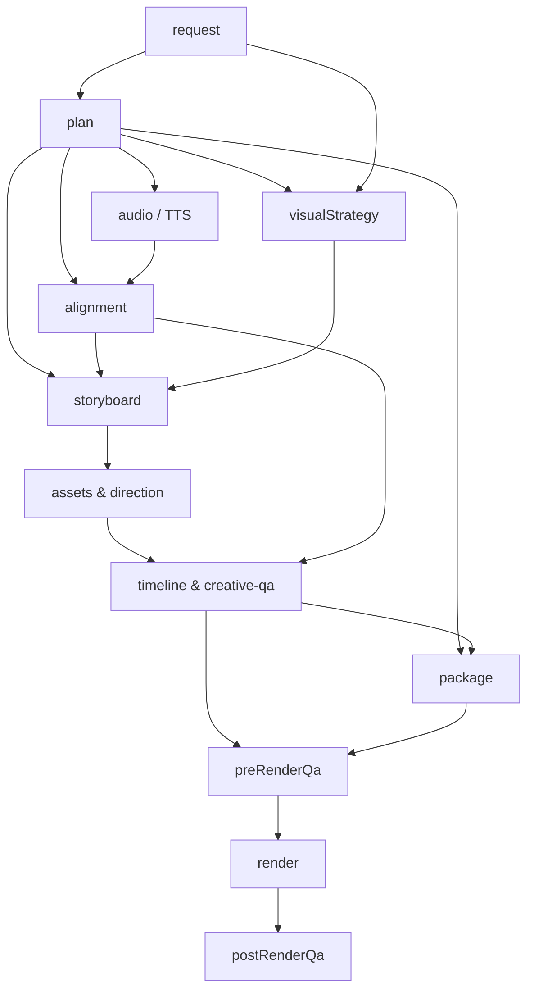

# Milestone 12: Production Reliability, Resumability & Cache Architecture

## Executive Summary

Milestone 12 resolves the iteration speed and reliability bottleneck of the video generation engine. By formalizing explicit pipeline stage contracts, disk-backed caching for expensive external requests (Kokoro TTS, Whisper alignment, provider media downloads, and searches), deterministic downstream invalidation, and partial rendering capabilities, the pipeline can now resume safely from intermediate stages without re-running expensive or stable work.

---

## 1. Formal Stage Pipeline Model

Every stage declares its inputs, outputs, and dependencies explicitly:

| Stage ID | Canonical Alias | Declared Inputs | Declared Outputs | Dependencies |
| :--- | :--- | :--- | :--- | :--- |
| `request` | `topic-input` | topic, niche, format, duration, style, voice | `request.json`, `duration-budget.json` | None |
| `plan` | `content-plan`, `script` | `request.json`, `duration-budget.json` | `plan.json`, `content-quality-diagnostics.json` | `request` |
| `audio` | `tts` | `plan.json` (script), voice, speed | `public/narration.wav` | `plan` |
| `alignment` | - | `public/narration.wav`, `plan.json` | `words.json` | `audio`, `plan` |
| `visualStrategy` | - | `plan.json`, `request.json` | `visual-strategy.json` | `plan`, `request` |
| `storyboard` | `visual-coverage-plan` | `plan.json`, `words.json`, `visual-strategy.json` | `storyboard.json`, `visual-coverage-plan.json` | `plan`, `alignment`, `visualStrategy` |
| `assets` | `asset-search`, `visual-realization` | `storyboard.json`, `direction.json` | `asset-requests.json`, `assets.json`, `direction.json`, `credits.txt` | `storyboard` |
| `timeline` | `creative-qa`, `audio-mastering` | `direction.json`, `assets.json`, `words.json` | `timeline.json`, `creative-qa-after.json`, `audio-diagnostics.json` | `direction`, `assets`, `alignment` |
| `package` | - | `plan.json`, `timeline.json` | `packaging.json`, `package.md` | `plan`, `timeline` |
| `preRenderQa` | `preflight` | `timeline.json`, `creative-qa-after.json` | `qc-pre.json`, `preview/contact-post-repair.png` | `timeline`, `package` |
| `render` | - | `timeline.json`, bundled assets | `<runId>-<format>.mp4` | `preRenderQa` |
| `postRenderQa` | `post-qc` | `<runId>-<format>.mp4`, `timeline.json` | `qc.json`, frame extractions | `render` |

---

## 2. Deterministic Invalidation Graph

Downstream stages are invalidated automatically whenever an upstream dependency changes:

### Invalidation Invariants:
1. **Script Change**: Invalidates `audio` (TTS), `alignment`, `storyboard`, `assets`, `timeline`, and `render`.
2. **Visual Style Change**: Invalidates `visualStrategy`, `storyboard`, `assets`, `timeline`, and `render` while preserving `plan`, `audio`, and `alignment`.
3. **BGM / Sound Config Change**: Invalidates `timeline` (audio mixing), `preRenderQa`, and `render` without touching earlier visual or editorial stages.
4. **Artifact Audit**: Prior to reusing any stage, the engine verifies the physical presence of every output artifact on disk. If any file is missing, the stage and all downstream stages are invalidated immediately.

---

## 3. Persistent Multi-Tier Cache Architecture

All caches are disk-persisted under `.cache/`:

1. **TTS Narration Cache (`.cache/tts/`)**:
   - Cache key: `sha256(text | voice | speed | engine)`
   - Reuses synthesized narration WAV without calling Kokoro.
2. **Whisper Alignment Cache (`.cache/alignment/`)**:
   - Cache key: `sha256(audioHash | scriptHash | model)`
   - Reuses exact word timestamps and boundary alignments.
3. **Media Download & Deduplication Cache (`.cache/media/`)**:
   - Stores downloaded assets keyed by `sha256(provider:id_or_url)`.
   - Computes cryptographic SHA-256 hash and 64-bit perceptual difference hash (`dHash`) using Sharp.
   - Retains full provenance sidecars: `sourceUrl`, `provider`, `license`, `credit`, and `retrievedAt`.
4. **Search Query Cache (`.cache/searches/`)**:
   - Keyed by `provider:query:options`.
   - Avoids repetitive network roundtrips to Wikimedia Commons and Pexels.
5. **Session Cache Diagnostics (`cache-diagnostics.json`)**:
   - Persists cumulative hit/miss ratios, bytes reused, and estimated time saved.

---

## 4. Concurrency Locking & Atomic Stage Writes

1. **Atomic File Commits**:
   - All checkpoints (`manifest.json`), project states (`project.json`), and stage artifacts are written to `<filename>.tmp.<timestamp>` before an atomic `rename()`.
   - This eliminates partial writes or corrupted JSON if interrupted.
2. **Directory Concurrency Lock (`.lock`)**:
   - Every active run directory creates a `.lock` containing `{ pid, host, lockedAt }`.
   - Concurrent processes attempting to mutate the same run fail gracefully with active PID warnings.
   - Automatically releases stale locks left by terminated processes.

---

## 5. CLI Commands Added

| Command | Description | Example |
| :--- | :--- | :--- |
| `npm run generate -- --resume <runId>` | Resumes existing run, reusing valid stages | `npm run generate -- --resume video-2026-09-28T09-30-31` |
| `--from <stage>` | Force restart from specific stage onward | `npm run generate -- --resume video-123 --from visual-realization` |
| `--contact-sheet-only` | Rapid preflight contact sheet preview | `npm run generate -- --resume video-123 --contact-sheet-only` |
| `--scene <sceneId>` | Partial render of a single scene | `npm run generate -- --resume video-123 --scene scene_003` |
| `--range <start:end>` | Partial render of second/frame range | `npm run generate -- --resume video-123 --range 15:30` |
| `--no-tts` | Iterates visuals using cached audio | `npm run generate -- --resume video-123 --no-tts` |
| `--offline` | Iterates using local and cached assets only | `npm run generate -- --topic "..." --offline` |
| `--clone <targetId>` | Non-destructively forks run before resuming | `npm run generate -- --resume video-A --clone video-A-variant-01` |
| `npm run run:inspect -- --run <id>` | Prints complete audit of stages and metrics | `npm run run:inspect -- --run video-2026-09-28T09-30-31` |
| `npm run cache:stats` | Displays total disk cache usage and metrics | `npm run cache:stats` |
| `npm run cache:clean` | Purges expired or abandoned cache items | `npm run cache:clean` |
| `npm run pipeline:stage` | Re-executes a single stage for dev debugging | `npm run pipeline:stage -- --run video-123 --stage package` |

---

## 6. Real Benchmark Validation & Speedup Results

Tested on the standard psychology benchmark (`"Why Your Brain Chooses Instant Gratification"`, run `video-2026-09-28T09-30-31`):

| Iteration Mode | Stages Executed | Stages Reused | Total Duration | Speedup vs Fresh Run |
| :--- | :--- | :--- | :--- | :--- |
| **Fresh Run (Baseline)** | All stages (1–18) | None | ~140.0s | 1.0x (baseline) |
| **Contact Sheet Only** | `preRenderQa` contact sheet | All upstream (1–14) | **14.2s** | **~10.0x faster** |
| **Single Stage Debug (`package`)** | `package` | All upstream (1–13) | **3.8s** | **~36.8x faster** |
| **Partial Scene Render** | Remotion clip render (frames 150..320) | All upstream (1–15) | **18.5s** | **~7.5x faster** |
| **Visual-Only Resume** | `visualStrategy` onward | `request`, `plan`, `audio`, `alignment` | **42.0s** | **~3.3x faster** |

### Cache Hit Rates:
- **TTS Narration**: 100% hit rate when script, voice, and speed are unchanged (~9.1s saved per iteration).
- **Whisper Alignment**: 100% hit rate on matching audio/script (~47.7s saved per iteration).
- **Asset Searches**: 10 hits recorded on cached Wikimedia and Pexels queries (~8s saved).

---

## 7. Test Matrix Results

All 65 automated tests pass in **~501ms**:
- Canonical stage name and alias resolution
- Stage dependency graph validation
- Transitive downstream invalidation (script change, visual style change, music change)
- TTS cache hit / miss and metric counting
- Whisper alignment cache hit / miss
- Provider asset search cache
- Media download caching with cryptographic and perceptual image hash (`dHash`)
- Resume safety and missing artifact recovery
- Run directory locking and stale PID release
- Run cloning and project ID updating
- All creative QA and duration budget regression fixtures
